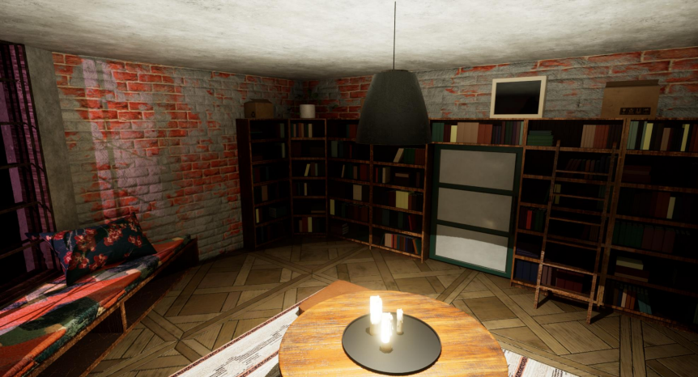
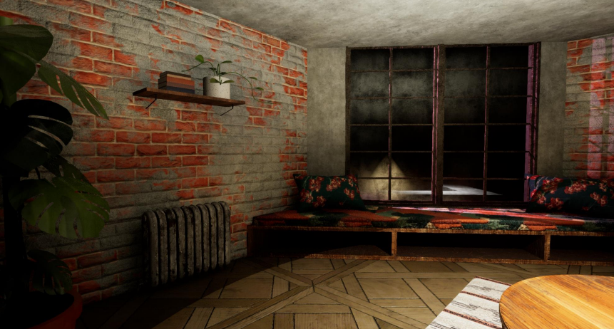
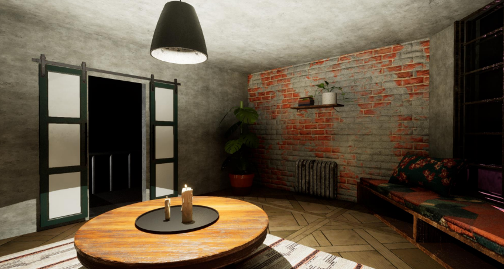

#Projet intégrateur 3D

Ce projet est mon projet intégrateur pour le cours de modélisation 3D. Il représente une pièce d’appartement abandonnée, inspirée de l’univers du jeu *Stray*, avec une attention particulière portée à l’ambiance, aux matériaux et à la narration visuelle.

## Pipeline utilisé

- **Modélisation :** 3ds Max
- **Texturing :** Substance 3D Painter, Substance Designer, Substance Sampler, Photoshop
- **Sculpture :** ZBrush
- **Moteur de rendu temps réel :** Unreal Engine 5

## Objectif

- Créer une ambiance post-apocalyptique cohérente et immersive
- Utiliser une pipeline complète de production 3D réaliste
- Maîtriser l’importation dans Unreal et le rendu en temps réel

## Aperçu visuel







## Utilisation

1. Cloner ce dépôt :
```bash
git clone https://github.com/Sophayie/3D_Project_Unreal.git
