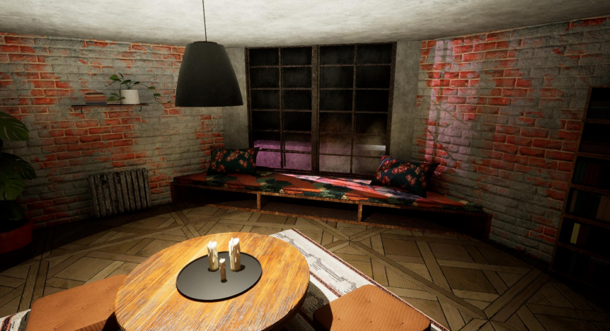
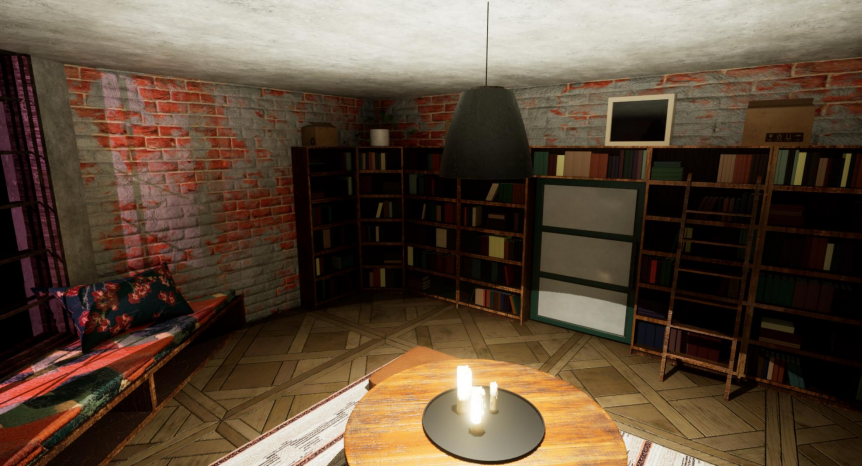
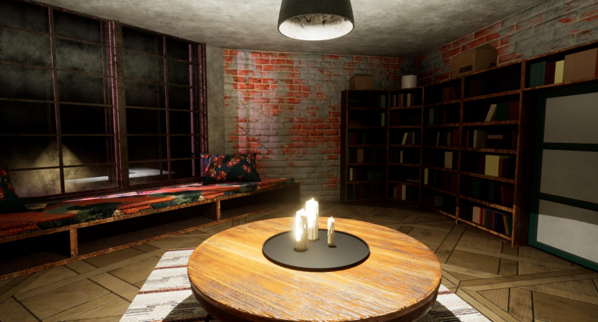
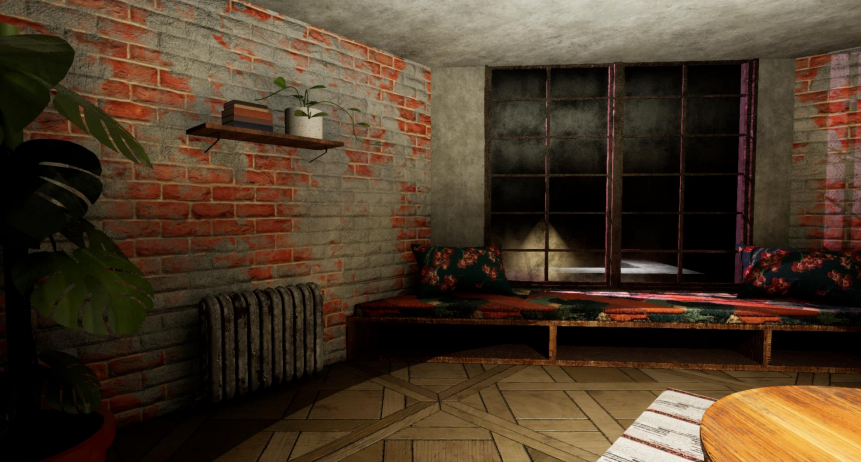
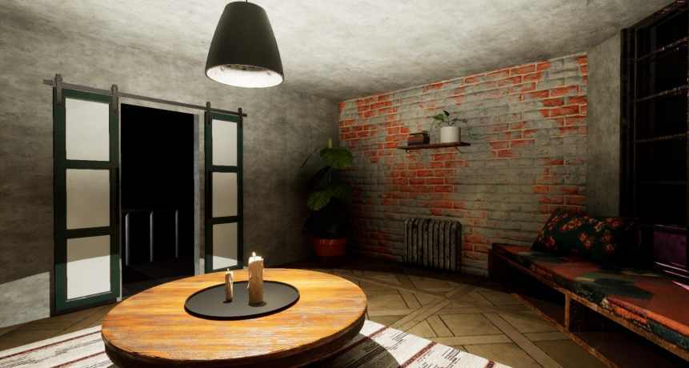
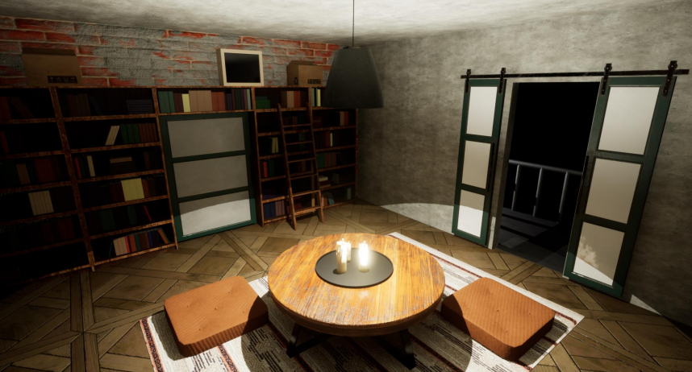

# 3D Capstone Project

This project is my final assignment for the 3D modeling course. It showcases an abandoned apartment room inspired by the universe of the game *Stray*, with a strong focus on mood, materials, and environmental storytelling.

## Production Pipeline

- **Modeling:** 3ds Max  
- **Texturing:** Substance 3D Painter, Substance Designer, Substance Sampler, Photoshop  
- **Sculpting:** ZBrush  
- **Real-time rendering engine:** Unreal Engine 5

## Goals

- Create a cohesive and immersive post-apocalyptic atmosphere  
- Use a complete and professional 3D production pipeline  
- Master importing and rendering scenes in Unreal Engine in real time

## Visual Preview








## Usage

1. Clone this repository:
```bash
git clone https://github.com/Sophayie/3D_Project_Unreal.git

